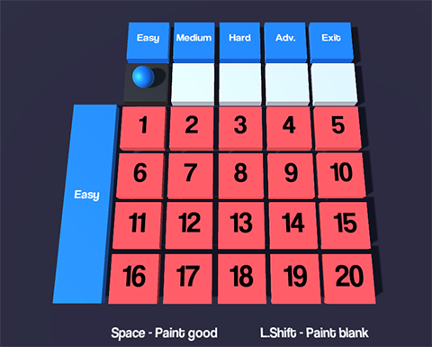
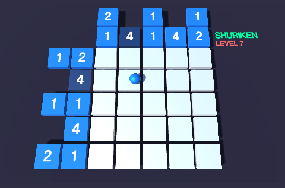
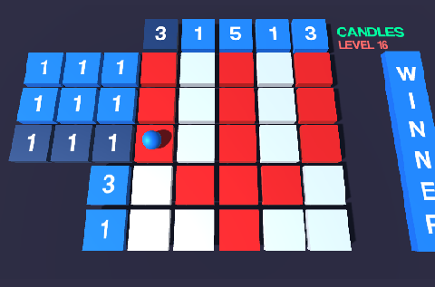

# Magic-Pictures
<a href="https://en.wikipedia.org/wiki/Nonogram">Nonograms</a> solving game made in Unity. 40 Levels included. (Unity v. 5.3.4)

<h3> Showcase </h3>

<h3> Notes </h3>
<b>To do</b>
- [x] Easy Levels
- [x] Medium Levels
- [ ] Hard Levels
- [ ] Advanced levels

